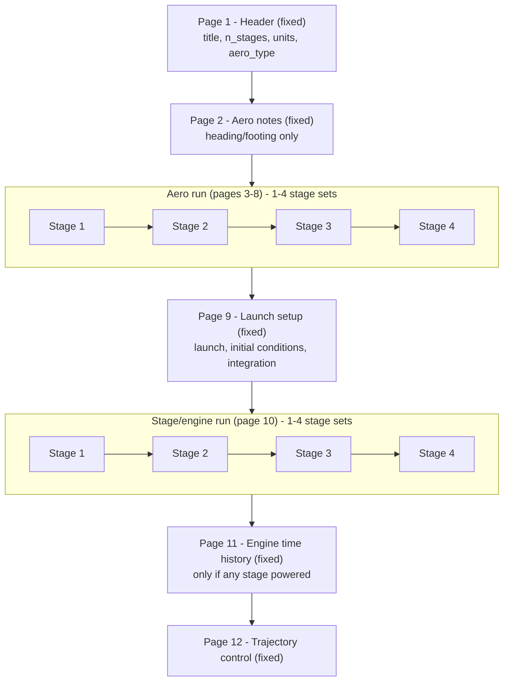

# RASOrbit UI Schema

Defines the **UI metadata** that drives the auto-generated editor. It complements the other
two metadata artifacts:

- [fields.csv](fields.csv) — the file-I/O source of truth (record order, structure, bounds).
- [SCHEMA.md](SCHEMA.md) — the `.dat` file format and record sequence.
- [pages.csv](pages.csv) — page copy (title, heading, footing) and structure flags.
- **This doc** — the UI layer: page structure (fixed / per-stage), page copy, field groups,
  and what stays in code.

## Decisions

1. **Concrete page model, not a UI DSL.** The organizing concept is **fixed pages** (shown
   once) vs **per-stage pages** (repeat `n_stages` times) — the diagram, not a general
   recursive UI tree. Metadata covers the pages that exist, without speculative generality.
2. **Requirements first.** Metadata encodes what the editor must render; avoid building a
   general rule engine.
3. **Two-layer, but modest.** `fields.csv` is authoritative for file I/O and field bounds;
   **`pages.csv`** holds page-level copy and structure flags. Field placement comes from the
   `page`/`group` columns in `fields.csv`.
4. **Page metadata is CSV.** Same style as `fields.csv`: flat rows, quoted prose cells,
   branch-specific copy as extra rows. Conditional logic (variant selection, page visibility,
   relabeling) lives in **code**; the CSV holds static text.
5. **Metadata vs code.** Behavior and validation may live in TypeScript where that is cleaner:
   branch relabeling, unit selection, autofills, display-hide rules, and cross-field
   validation.
6. **Metadata is content, not chrome.** Page metadata holds **title, heading, and footing**
   text only — not Save/Cancel, OK/Cancel, Next/Back, modals, or wizard steps. File-level
   Open/Save/dirty state lives in the app shell.
7. **View-agnostic metadata.** The page catalog can drive a wizard, an outline, a single
   scroll, or a page grid. Navigation layout is a **view choice**, not encoded in metadata;
   the intended presentation is free nav (outline: stage → page).
8. **The UI collects only what `InputFile` persists.** A control with nowhere to land in the
   file has nothing to bind to. No UI-only data fields.
9. **Page structure.** Header once (page 1); per-stage **aero** (pages 3–8) and per-stage
   **stage/engine** (page 10) are two separate runs; launch (9), engine history (11, only if
   powered), and trajectory (12) are once. Page 2 is text-only (no fields).
10. **Full-file scope.** All 12 pages are in scope; `InputFile` reads/writes the entire file.

## Requirements

Requirements the metadata (plus `fields.csv` and code) must satisfy:

### Structure

- **12 pages** in file order, with page 2 field-free (aero notes).
- **Fixed vs per-stage** pages; two **runs** (aero 3–8, stage/engine 10); up to **4 stage
  sets** per run (`n_stages` 1–4).
- **Conditional pages/blocks:** page 11 when any stage is powered; engine sub-blocks on page 10
  by `engine_type`; field-level `when` from `fields.csv`.
- **Field groups** within a page (`group` column) for visual clustering when rendering controls — not extra heading text.

### Page copy

Per page, text matching the input screens (see Sources in [SCHEMA.md](SCHEMA.md)):

- **Title** — nav label / breadcrumb / card title (e.g. "3rd Input Page – SI Units – CN, CA,
  CP"). Not in the `.dat`; ours for UX. Branch suffixes where slides vary.
- **Heading** — intro body above the fields (e.g. "Notes on Aerodynamic Data", launch-mode
  descriptions). May include lightweight markup.
- **Footing** — notes, caveats, red-slide warnings below the fields (e.g. CG/inertia bypass,
  TVC zeros, power-off aero explanations).

Where slides fork on configuration, heading and/or footing (and sometimes title) need **branch
variants** — not a single static string. See [Branch variants for page copy](#branch-variants-for-page-copy).

### Field rendering

- Controls from `fields.csv` (`text`, `number`, `radio:…`, `grid`).
- **Matrices:** Mach = rows, AoA = columns (from field `kind`/`count`).
- **Vectors:** length from count fields; 8 values per line in the file (layout in code).
- **Units** on labels from `units` (English vs SI) — code, per SCHEMA.md.
- **Label branches** from `aero_type`, `launch_mode`, `traj_control`, `engine_type` — mostly
  code + `validate` column hints; not duplicated in page heading/footing.

### Behavior (mostly code)

- Live **validation** and error highlighting; save refused when invalid.
- **Autofills** (Vertical launch, `initial_heading_azimuth`, etc.).
- **Display-hide** where file still stores a value (e.g. `nose_radius` when heating = No).
- **Popup warnings** (360° azimuth/longitude) — validation UX, not page metadata.
- **Dynamic chrome:** "For Stage *N*:" — template in code from stage index + `n_stages`.
- **New-file UX:** blank vs 0.0000 defaults — product choice in code.

### Navigation

- Outline with **stage → page** nesting for per-stage content; fixed pages at root.
- File actions (Open, Save, dirty prompt) in the app shell — not per-page buttons.

## Page model (fixed vs per-stage)

The file (and the editor) is a fixed sequence of pages, some shown **once** and some repeated
**per stage**. It follows the record sequence in [SCHEMA.md](SCHEMA.md#record-sequence).

### Terminology

To avoid overloading **group** (reserved for within-page field clusters in `fields.csv`):

- **Page** — a screen (1–12); either **fixed** (shown once) or **per-stage**.
- **Run** — a contiguous span of per-stage pages that repeat together (there are two); same
  term as in `SCHEMA.md`.
- **Stage set** — one instance of a run, for one stage (1–4).

### At a glance (file order)

```text
┌──────────────────────────────────────────────────────────┐
│ FIXED       Header                    pages 1-2          │
├──────────────────────────────────────────────────────────┤
│ PER-STAGE   Aero run                  pages 3-8   x(1-4) │
├──────────────────────────────────────────────────────────┤
│ FIXED       Launch setup              page 9             │
├──────────────────────────────────────────────────────────┤
│ PER-STAGE   Stage / engine run        page 10     x(1-4) │
├──────────────────────────────────────────────────────────┤
│ FIXED       Engine hist, Trajectory   pages 11-12        │
└──────────────────────────────────────────────────────────┘
  page 11 only if any stage is powered
```

### In detail



### Metadata mapping

- **Fixed vs per-stage (up to 4 stage sets).** The aero run and the stage/engine run each
  produce one stage set per stage. The two runs are separate (fixed page 9 between them).
- **Conditional pages/blocks.** Page 11 and page-10 engine sub-blocks use `when` from
  `fields.csv` (page 11 visibility can also be stated once in `pages.csv` or inferred in code).
- **Field groups.** The `group` column clusters fields for layout (spacing, dividers) within a page — not displayed as headings.
- **Page 2.** Text-only fixed page; no fields in `fields.csv`.

## Page metadata (`pages.csv`)

Each row carries **copy** and **structure** for one page (or one branch variant of a page).
Fields are not duplicated — they come from `fields.csv` by `page` number.

### Columns

| Column | Required | Meaning |
|--------|----------|---------|
| `page` | yes | Page 1–12 (matches `fields.csv` `page` and PDF ordinal). |
| `kind` | yes | `fixed` or `per_stage`. |
| `run` | if per_stage | `aero` (pages 3–8) or `stage_engine` (page 10); blank for fixed pages. |
| `when` | no | Page visibility (e.g. page 11: `any(engine_type>0)`). Blank = always show. May be inferred from `fields.csv` instead. |
| `branch` | yes | `default`, or a simple predicate matching current file state (e.g. `aero_type=1`, `launch_mode=0`). Code picks the best-matching row. |
| `title` | yes | Short nav label. |
| `heading` | no | Intro text above fields; markdown-ish; quoted if multiline. |
| `footing` | no | Notes below fields; markdown-ish; quoted if multiline. |

**Not in the CSV:** Save/Cancel, modals, layout widgets, styling, executable conditions beyond
the simple `branch`/`when` strings.

Structure columns (`kind`, `run`, `when`) repeat on branch rows for the same page, or appear
only on the `branch=default` row — loader normalizes either way.

### Branch variants for page copy

Slides change title/heading/footing with configuration. Add **extra rows** with the same `page`
and a more specific `branch` (use only where the PDF actually forks):

| Branch key | Affects (typical) |
|------------|-------------------|
| `units` | Title suffixes on many pages — may be **assembled in code** rather than stored for all four combinations. |
| `aero_type` | Pages 1–8, especially 2 (two full note bodies) and 6 (power-off wording). |
| `launch_mode` | Page 9+ titles; page 9 heading (Vertical vs Conventional launch prose). |
| `engine_type` | Page 11 title/heading (Chamber Pressure vs Thrust history). |
| `traj_control` | Page 12 title (Pitch vs AoA). |

**In code, not CSV:** resolving which branch row wins; dynamic title suffixes ("SI Units –
CN, CA, CP"); "For Stage *N*:"; field relabeling; page 11 hide when all stages unpowered.

### Example

```csv
page,kind,run,when,branch,title,heading,footing
2,fixed,,,default,Aerodynamic Data Notes,,
2,fixed,,,aero_type=1,,"Notes on aerodynamic data (CN/CA/CP branch). …",
2,fixed,,,aero_type=0,,"Notes on aerodynamic data (CL/CD/CP branch). …",
3,per_stage,aero,,default,Aerodynamic Data,"Enter angles of attack and Mach numbers, then the coefficient grid.","Mach = rows, angle of attack = columns."
9,fixed,,,default,Launch Setup,,
9,fixed,,,launch_mode=1,,"Vertical launch: launched vertically from the pad; pitch 90°, …",
9,fixed,,,launch_mode=0,,"Conventional flight: any initial condition including air-launch; …",
11,fixed,,any(engine_type>0),default,Engine Time History,,
11,fixed,,any(engine_type>0),engine_type=1,,Chamber Pressure Time History,
11,fixed,,any(engine_type>0),engine_type=2,,Thrust Time History (Thrust Curve),
```

(Full text for all 12 pages belongs in `pages.csv`.)

### Page coverage

| Page | title + heading + footing + fields.csv | Also needs |
|------|----------------------------------------|------------|
| 1 | yes | 80-char title rule (validation, code) |
| 2 | yes (no fields) | two `aero_type` note variants |
| 3–5 | yes | matrix labels branch via field relabeling (code) |
| 6 | yes | two `aero_type` footing variants; Mach autofill (code) |
| 7–8 | yes | unit suffixes on labels (code) |
| 9 | yes | `launch_mode` heading variants; hide/show, warnings (code) |
| 10 | yes | engine-type legends in heading/footing; sub-blocks via `when` |
| 11 | yes | page `when`; `engine_type` title/heading variants |
| 12 | yes | `traj_control` title variants; middle column relabel (code) |

Nothing in the input screens requires wizard buttons, modals, or a separate popup mechanism in
metadata.

## Field-level display

### From `fields.csv`

| Column | UI use |
|--------|--------|
| `page`, `group` | Placement and within-page layout clusters |
| `label` | Default field label |
| `control` | Widget type (`text`, `number`, `radio:…`, `grid`) |
| `min`, `max`, `step` | Bounds and spinner increment |
| `when` | Show/hide field (and infer page 11 visibility) |
| `validate` | Human hints for rules implemented in code |

### In code

| Behavior | Source |
|----------|--------|
| Unit suffixes on labels (ft vs m, lbs vs kg, …) | `units` + SCHEMA.md unit table |
| `cn`/`ca`/`dca_off` → CL/CD/DCD labels | `aero_type` |
| Launch azimuth ↔ Initial Heading | `launch_mode` |
| Trajectory middle column label | `traj_control` |
| Page 11 value column label/units | `engine_type` |
| Autofills, cross-field validation | `validate` + InputFile |
| Display-hide (`nose_radius`, etc.) | code |
| Matrix row/column headers (Mach, AoA) | field `kind`/`count` + labels |
| 8-wide vector wrapping | file format / layout code |

## Behavior in code

Logic implemented in TypeScript rather than metadata.

### Branch relabeling and units

- **`units`:** label/unit display only; stored values unchanged (SCHEMA.md).
- **`aero_type`:** relabel `cn`/`ca`/`dca_off` as CL/CD/DCD when = 0.
- **`engine_type` (page 11):** history value labeled Chamber Pressure vs Thrust.

### Launch and trajectory (pages 9 and 12)

- **`launch_mode`:** `0` Conventional, `1` Vertical. Relabel `launch_azimuth` (and the
  derived heading field) per SCHEMA.md; Vertical autofills pitch=90, bank=0, aoa=0.
- **`traj_control`:** relabel middle trajectory column (Pitch Attitude vs Angle of Attack).
- **`initial_heading_azimuth`:** always equals `launch_azimuth` (both modes). Hard-wired
  autofill: show the value, never accept separate edits. Writer mirrors `launch_azimuth` into
  the `initial_heading_azimuth` slot on save.
